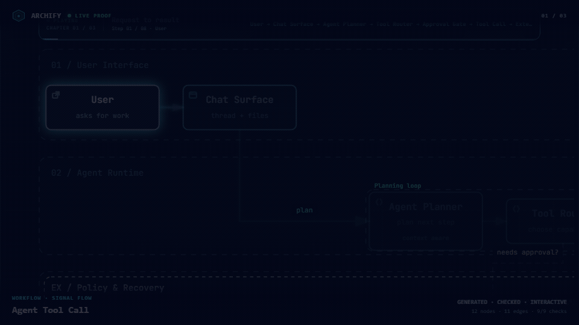

<p align="center">
  <strong>English</strong> · <a href="./README_ZH.md">简体中文</a>
</p>


# Archify — Rearchify fork

**Turn a codebase or system description into a polished, interactive system map — directly in chat.**

Archify is a Node.js rendering and validation system for Cursor, Claude Code, Codex CLI, and OpenCode. Agents produce typed JSON IR; Archify deterministically compiles it into HTML/SVG.

- **Open it and present** — five diagram types, four presets, dark/light themes, built-in brand marks, and finite motion
- **Review architecture changes before merge** — compare two validated snapshots as Before / Delta / After, with exact added, removed, changed, moved, and rerouted facts
- **Every interaction stays grounded** — search nodes, optionally open revision-verified source, trace upstream/downstream authored reach and exact routes, compare roles, and play guided stories without inventing topology
- **One file, ready to trust and share** — typed JSON IR and deterministic checks produce self-contained HTML plus PNG, SVG, WebM, and 1200×630 share cards


**Current development version:** `v2.17.0-dev.1`. See [Changelog](CHANGELOG.md#unreleased).

**[Upstream project page](https://tt-a1i.github.io/archify/)** · **[Scenario guide](https://tt-a1i.github.io/archify/guide.html)** · **[Proof Lab](https://tt-a1i.github.io/archify/gallery.html)**

```bash
npx skills add safwyls/rearchify --skill archify rearchify -g
```

Already using upstream Archify? Follow [Replace an existing Archify installation](#replace-an-existing-archify-installation) below. The upstream quick-start page installs upstream Archify.

**No repository is required:** describe the system in any agent chat.

## Changes in this fork

[Rearchify](https://github.com/safwyls/rearchify) is a fork of [Archify](https://github.com/tt-a1i/archify), under the MIT license. Hosted docs, demos, and DSH links below refer to upstream.

- **Offline architecture editing:** drag nodes, path segments, bends, endpoint attachments, and labels; snap to the grid or path, add/remove jogs, and restore automatic routing.
- **Editable boundaries:** draw, resize, move, relabel, or delete fixed frames. Membership follows node moves; validation rejects inconsistent membership and preserves explicit rectangles.
- **Save and resume:** undo/redo, save JSON or standalone HTML, or apply edits. Editor and CLI share rendering.
- **Reliable integration:** delta reports include endpoint offsets; tests cover browser interaction, JSON round trips, diagnostics, and Windows portability.

Open newly generated architecture HTML and choose **Edit layout**. Edits are drafts: run `validate` and `deliver` on saved JSON before sharing. See [editing controls](archify/references/viewer-runtime.md).

## Replace an existing Archify installation

The fork is called **Rearchify**, but the installed skill is still named **`archify`**, and the CLI remains `bin/archify.mjs`. Replace the upstream package in the same agent and scope; do not rename its folder to `rearchify` or keep competing upstream and fork copies active.

For a global installation managed by `skills`:

```bash
npx skills remove archify --global
npx skills add safwyls/rearchify --skill archify rearchify --global
```

Select the agents you previously used. For a project installation, run the same commands from that project **without `--global`**. If both scopes contain Archify, replace or remove the upstream copy in each relevant scope so the agent cannot select an old version. See the [skills CLI documentation](https://github.com/vercel-labs/skills#readme) for agent selection options.

For a manual ZIP installation, back up any custom files and diagrams stored inside the installed skill folder, move the old `archify` folder outside the agent's skill search directories, and extract this fork's [archify.zip](archify.zip) into the same skills directory. Replace the whole package, including its renderer and assets; replacing only `SKILL.md` does not add the editor.

Reload your agent or start a new session, then confirm the loaded `archify/SKILL.md` contains **Refresh existing HTML** and `references/rearchify.md` exists. Set `ARCHIFY_UPDATE_CHECK_DISABLED=1` in the environment used to launch your agent to disable upstream update reminders. Get future fork updates from `safwyls/rearchify`; the upstream quick-start and DSH links elsewhere in this README do not install this fork.

Existing JSON files remain the source of your diagrams. **Installing the fork does not update HTML you already generated**; refresh each desired diagram with `/rearchify` below.

## Refresh old diagrams with `/rearchify`

`/rearchify` asks the agent to rerun `deliver` with this fork's renderer. Architecture HTML gains **Edit layout**, letting you move nodes and adjust paths locally without model calls. Other diagram types can be regenerated, but do not gain the architecture editor.

The install commands above include both `archify` (the renderer) and `rearchify` (the refresh entry point). **Copilot Chat in VS Code exposes the companion as `/rearchify` automatically** after reloading; no prompt-file copy is needed. To add it to an existing fork installation for Copilot:

```bash
npx skills add safwyls/rearchify --skill archify rearchify --agent github-copilot --global --copy --yes
```

Omit `--global` for project installs. Manual ZIP installs contain only `archify`; use the command above for automatic companion installation, or put the [rearchify folder](rearchify) beside the installed `archify` folder. If you previously copied `.github/prompts/rearchify.prompt.md`, remove that old prompt after installing the companion to avoid duplicate names. [VS Code skills documentation](https://code.visualstudio.com/docs/agent-customization/agent-skills#use-skills-as-slash-commands).

Then run in chat:

```text
/rearchify diagrams/system.architecture.json diagrams/system.html
```

Or point to an existing HTML file:

```text
/rearchify diagrams/system.html
```

For HTML input, the agent locates the original JSON or your latest saved JSON. Legacy HTML may not contain that source; if it is missing, the agent asks for it instead of reconstructing the diagram. With no output argument, HTML input is refreshed at its existing path; JSON input produces a sibling `.html` file. Existing output is backed up before replacement.

Refresh preserves the source, layout, and quality profile; validation failures stop without automatic repairs. Local architecture handoffs start a background editor and return its URL. Use **Edit layout**, **Apply & close**, then **Save & deliver** to persist changes. See [start, status, and stop commands](archify/references/viewer-runtime.md) for managing the service later. Standalone HTML supports offline editing and downloads.

In clients without this custom slash command, invoke the Archify skill and write `Use /rearchify to refresh diagrams/system.architecture.json`. This is an agent workflow, **not a CLI subcommand**. To run delivery directly from a checkout of this fork:

```bash
node archify/bin/archify.mjs deliver architecture diagrams/system.architecture.json diagrams/system.html --json
```

Direct CLI use does not perform the agent workflow's backup step; keep a copy or choose a new output path when needed. See the [refresh workflow](archify/references/rearchify.md) for details.

## Deliver → edit → save → deliver

Open the live editor URL returned by the skill. **Edit layout** opens the editor;
**Apply & close** reloads the reader with a tab-local draft but does not save files.
It requires browser session storage. **Save & deliver** appears in the main toolbar
only for an applied draft while the local service responds to its heartbeat.

Saving sends the edited JSON to the local Node service without an LLM call. The
service runs normal delivery checks on staged files. Success replaces the source
JSON and HTML, writes `<output-stem>.delivery.json` with hashes, and reloads the
delivered diagram. Repeat the loop as needed. Delivery checks are deterministic;
they do not include browser or perceptual review.

From this fork's checkout, after running `deliver`:

```bash
node archify/bin/archify.mjs edit start architecture diagrams/system.architecture.json diagrams/system.html
node archify/bin/archify.mjs edit status diagrams/system.html
node archify/bin/archify.mjs edit stop diagrams/system.html
```

Open the URL from `edit start`; pass the same explicit `--quality` and `--repo-root`
options as delivery. With the CLI on PATH, `archify edit` discovers project diagrams
and offers a chooser; `archify edit diagrams/system.html` selects an output.
Direct `deliver` never starts a service. Matching starts reuse the background
service. Closing the tab does not stop it; run `edit stop` after any save finishes.

The service binds to `127.0.0.1`, handles one source/HTML pair, and checks the session
token and request origin. `<output.html>.editor-session.json` is private process
state, not a shareable artifact. Validation failure preserves existing files;
write failures attempt rollback and report recovery backups if rollback fails.
Changes on disk after page load cause a save conflict; download the draft before
reloading. Source/HTML mismatches are rejected on page load; after external JSON edits, rerun
`deliver` before reopening the service URL. Validation settings survive service stops
in `<output.html>.editor-settings.json`; keep this local sidecar private too.

Opening standalone HTML directly supports offline editing but cannot overwrite
source files. **Save JSON** downloads source; **Download HTML** creates an editable
draft without the live session. Save downloaded JSON to the intended source path,
then rerun `deliver`. See [editor controls](archify/references/viewer-runtime.md).

## See Archify in action

These are generated Archify artifacts, not product mockups. Click a frame to open its live, shareable state.

<p align="center">
  <a href="https://tt-a1i.github.io/archify/gallery.html"></a>
  <br/>
  <sub><strong>Three real generated artifacts.</strong> Signal Flow · Blueprint · Classic · <a href="https://tt-a1i.github.io/archify/gallery.html">open the interactive Proof Lab ↗</a></sub>
</p>

| Guided story | Route probe | Semantic lens |
|---|---|---|
| [](https://tt-a1i.github.io/archify/gallery/artifacts/agent-tool-call.workflow.html?theme=dark&present=1&play=1#view=happy-path) | [](https://tt-a1i.github.io/archify/gallery/artifacts/cache-miss.sequence.html?theme=dark&present=1#route=web~db) | [](https://tt-a1i.github.io/archify/gallery/artifacts/production-deployment.architecture.html?theme=dark&present=1#lens=backend~database) |
| Play one finite named chapter. | Inspect the shortest authored directed path. | Compare real traffic between semantic roles. |

The [Proof Lab](https://tt-a1i.github.io/archify/gallery.html) contains all 11 checked-in scenarios, their JSON sources, named views, and validation receipts.

### A real repository, mapped from source

[](https://tt-a1i.github.io/archify/cases/mco-runtime.architecture.html?theme=dark&present=1#view=dispatch-path)

Archify traced [`mco-org/mco`](https://github.com/mco-org/mco) at `9f1a1cf` and produced this checked map. **[Open it ↗](https://tt-a1i.github.io/archify/cases/mco-runtime.architecture.html?theme=dark&present=1#view=dispatch-path)** · [trace reach ↗](https://tt-a1i.github.io/archify/cases/mco-runtime.architecture.html?theme=dark#focus=router&reach=downstream) · [typed source](docs/cases/mco-runtime.architecture.json)

## Preview

Same diagram, two themes, one click to switch:

| Dark | Light |
|---|---|
|  |  |

The Export menu copies PNG to the clipboard and downloads static or motion formats:


Use **Copy Share Card** when you want a canonical 1200×630 image for a README, release, or social post.

After tracing a route, **Export → Route Share Card** downloads that authored path as a 1200×630 PNG with the full diagram retained for context.


After tracing authored `Upstream` or `Downstream` reach, **Export → Reach Share Card** captures that exact reading without claiming runtime impact.


Open [`examples/web-app.html`](examples/web-app.html) locally to try the complete viewer.

## Quick start

### 1. Install

```bash
npx skills add safwyls/rearchify --skill archify rearchify -g
```

For an explicit, non-interactive Cursor install:

```bash
npx -y skills add safwyls/rearchify --skill archify rearchify --agent cursor --global --copy --yes
```

To try without installing:

```bash
npx skills use safwyls/rearchify@archify --agent codex
```

[DSH community opt-in](integrations/deepseek-harness/README.md): `dsh plugin --profile web add @tt-a1i/archify-dsh@0.1.0`

The [agent switcher](https://tt-a1i.github.io/archify/start.html?agent=cursor&type=architecture) covers `cursor`, `codex`, `claude-code`, and `opencode`. For Raven's manual ZIP install, extract [`archify.zip`](archify.zip) into `~/.raven/workspace/skills`; it yields `~/.raven/workspace/skills/archify`. Raven is not a switcher target.

Archify may GET the fixed stable manifest solely to show an optional reminder; it never downloads or installs updates. Successful checks wait about 72 hours (±20%); active use retries failures after 6, then 24 hours. The server sees normal HTTP metadata (IP and time), but receives no version, Agent, project data, prompts, account/device ID, or ETag. You decide whether and when to update. Fork installs should set `ARCHIFY_UPDATE_CHECK_DISABLED=1` to disable upstream update reminders and their networking/state writes; update this fork from `safwyls/rearchify`.

### 2. Start from a description — no repository required

```text
Use Archify to draw: Browser -> API -> Redis cache -> PostgreSQL fallback.
```

For source evidence, open a repository and ask:

```text
Analyze this repository, then use archify to create a high-level runtime architecture diagram.
Show 8–12 core components, one primary path, external dependencies, and trust boundaries.
Put supporting detail in cards instead of adding more edges.
```

### 3. Refine in chat

Continue with focused requests such as `add Redis`, `move auth to the left`, or `highlight the rollback path`. Archify keeps the typed source available for targeted iteration.

## Choose the right diagram

| Type | Best for | Include in your prompt |
|---|---|---|
| **Architecture** | Components, services, storage, boundaries | Scope, core components, primary path |
| **Workflow** | CI/CD, approvals, tool calls, runbooks | Participants, order, branches, exceptions |
| **Sequence** | API calls, cache fallback, auth, async traces | Callers, callees, returns, timing |
| **Data Flow** | Pipelines, lineage, PII, consumers | Sources, transforms, stores, boundaries |
| **Lifecycle** | States, retries, waits, terminal outcomes | States, events, retry and cancellation paths |

Architecture's optional `deployment-ownership` profile fails closed when authored owners, region placement, private database scope, or named crossings are missing; it is never implicit and does not inspect live infrastructure. See the [checked deployment proof](https://tt-a1i.github.io/archify/gallery.html#proof-deployment-ownership).

For design or PR review, Architecture Delta compares validated Before / Delta / After snapshots with a machine receipt. Select an authored change or play one finite, viewer-only Review; it infers no impact, risk, or merge safety.

`node archify/bin/archify.mjs compare architecture base.json head.json architecture-delta.html --json`

[](examples/checkout-platform-delta.html)

Not sure which one fits? Use the [interactive scenario guide](https://tt-a1i.github.io/archify/guide.html), or ask the zero-dependency CLI:

```bash
node archify/bin/archify.mjs guide "Show an API request with Redis cache miss"
node archify/bin/archify.mjs guide "Map Kafka topics, consumer groups, replay, and DLQ" --json
```

Workflow keeps the happy path clear across lanes:


Sequence explains one interaction over time:


Data Flow makes movement and sensitivity boundaries explicit:


Lifecycle separates progress, waits, retries, and terminal outcomes:


Architecture examples: [`web-app`](examples/web-app.html) · [`Archify pipeline`](examples/archify-repo.html) · [`grid placement`](examples/archify-repo-grid.html) · [`desktop agent`](examples/maka-architecture.html)

## Why Archify

- **Layout judgment over generic auto-layout** — the agent chooses hierarchy, spacing, routes, and emphasis; shared automatic endpoints spread deterministically instead of piling arrows on one midpoint.
- **Typed JSON IR** — every renderer-backed mode has a schema and reproducible source.
- **Atomic validation before delivery** — schema, layout, HTML/SVG, route, and label-to-route clearance checks must all pass before a showcase artifact replaces the last known good output.
- **Failures come with a repair receipt** — `validate --json` and `deliver --json` return stable rule codes, the exact subject, measured evidence, and only supported repair controls instead of a Node stack or an unstructured retry guess.
- **Last-good live preview** — an optional desktop loop watches one JSON file, refreshes only after the latest candidate passes every gate, and keeps the previous verified diagram visible when a save is incomplete or invalid.
- **Truthful interaction** — focus, upstream/downstream reach, exact routes, role comparison, and stories reuse authored nodes and relationships instead of inventing topology or claiming runtime impact.
- **Source evidence, only when requested** — Evidence-backed Architecture nodes mark themselves `SRC n` and open Git-verified files and line ranges pinned to one public commit; ordinary artifacts stay source-free.
- **Portable by default** — the result is one HTML file; exports remain full-diagram and free of temporary viewer state.

Archify is not a general-purpose drawing editor or a Mermaid theme. It turns technical intent into a communication artifact.

## How it works

| Step | What happens |
|---|---|
| **Generate** | The agent creates typed JSON IR from your description. |
| **Validate** | Bundled validators and layout rules check the source; failures identify the exact local repair in machine-readable JSON. |
| **Preview (optional)** | A loopback-only desktop session watches one source and reloads only verified revisions; failures keep the last-good artifact. |
| **Deliver** | A same-directory candidate is rendered and checked; only a passing artifact atomically replaces the target, then optional `--open` launches that exact file. |
| **Iterate** | The agent updates the source while unrelated structure stays stable. |

Useful repository commands:

```bash
cd archify
node bin/archify.mjs doctor
node bin/archify.mjs demo /tmp/archify-demo
node bin/archify.mjs guide "Show CI/CD checks, approval, deploy, and rollback"
node bin/archify.mjs validate workflow examples/agent-tool-call.workflow.json --quality showcase --json
node bin/archify.mjs preview workflow examples/agent-tool-call.workflow.json /tmp/workflow.html --quality showcase
node bin/archify.mjs deliver workflow examples/agent-tool-call.workflow.json /tmp/workflow.html --quality showcase --open --json
```

`preview` is an explicit loopback-only desktop mode: it watches one JSON file on a random `127.0.0.1` port, keeps the last verified output through failures, stops with Ctrl-C, and adds no generated-HTML runtime. Use `--no-open` for tests or manual URL opening.

`deliver --open` is an opt-in one-shot handoff after commit. Opener failure preserves success; JSON remains on stdout and the absolute fallback path goes to stderr.

On failure, `validate --json` and `deliver --json` emit one JSON object. Apply only each `diagnostics[]` subject's `supportedFixes`, within the Skill's two correction rounds; visual review remains separate.

Settings:

```json
{
  "meta": {
    "locale": "en",
    "animation": "trace",
    "visual_preset": "signal-flow"
  }
}
```

`meta.locale=en|zh-CN` localizes page title, Legend, states/errors, a11y, HTML/SVG `lang`—never authored content. Otherwise omit; preserve requested-language copy; disclose English fallback. Static omits `animation`; `classic` defaults.

## Explore and share the output

| Action | Control |
|---|---|
| Open the factual Diagram Guide | <kbd>?</kbd> |
| Find and focus a semantic node | <kbd>/</kbd> |
| Trace upstream/downstream authored reach | Focus a node → `Upstream` / `Downstream` |
| Probe a directed route and inspect its journey | <kbd>R</kbd> or `PATH` |
| Compare one or two semantic roles | <kbd>L</kbd> or `LENS` |
| Open the live overview radar | <kbd>M</kbd> or `MAP` |
| Play a guided story / change chapter | <kbd>P</kbd> / <kbd>[</kbd> <kbd>]</kbd> |
| Enter Presentation Stage | <kbd>F</kbd> |
| Choose visual style (`S` cycles) / toggle theme / open Export | <kbd>S</kbd> / <kbd>T</kbd> / <kbd>E</kbd> |
| Zoom or reset | <kbd>+</kbd> / <kbd>-</kbd> / <kbd>0</kbd> |

Stable links can restore `#focus=<id>`, `#focus=<id>&reach=upstream|downstream`, `#relation=<id>`, `#route=<source>~<target>`, `#lens=<kind>~<kind>`, and `#view=<view-id>`. Reader-driven motion is finite, respects `prefers-reduced-motion`, and never enters canonical exports.

The complete generation and viewer contract lives in [`archify/SKILL.md`](archify/SKILL.md).

## Installation options

| Surface | Install location or method | Capability |
|---|---|---|
| **Raven** | Manual ZIP into `~/.raven/workspace/skills` → `~/.raven/workspace/skills/archify` | Full renderer + validation workflow |
| **Claude Code** | `~/.claude/skills/` or `.claude/skills/` | Full renderer + validation workflow |
| **Codex CLI** | `~/.agents/skills/` or `.agents/skills/` | Full renderer + validation workflow |
| **opencode** | `~/.config/opencode/skills/`, `.opencode/skills/`, or `.agents/skills/` | Full renderer + validation workflow |
| **Claude.ai** | Upload `archify.zip` under Settings → Capabilities → Skills | Depends on Node.js access in the sandbox |
| **Project Knowledge** | Upload `archify.zip` to the project | Prompt-driven architecture fallback |
| **DeepSeek Harness** | Opt-in: `dsh plugin --profile web add @tt-a1i/archify-dsh@0.1.0`. Invoke: `Use the archify skill to map this repository's runtime architecture.` Remove: `dsh plugin --profile web remove @tt-a1i/archify-dsh`. | Community integration for developer-preview `@deepseek-ai/dsh@0.1.0-rc.6`; Node `^22.19.0 \|\| >=24.0.0`; not an official DeepSeek product. No telemetry. Shell files need exact workspace paths, not Web Produced Files. [Details](integrations/deepseek-harness/README.md). |

## Reference and scope

- [Schema reference](archify/schemas/README.md) · [Skill](archify/SKILL.md) · [Examples](archify/examples/) · [Agent cookbook](docs/authoring-cookbook.md)
- [Changelog](CHANGELOG.md)
- [Roadmap](ROADMAP.md)
- [Generated Proof Lab](https://tt-a1i.github.io/archify/gallery.html)

Automatic Mermaid parsing, general-purpose auto-layout, and hosted sharing remain outside the current scope. Visual editing is limited to architecture layouts.

## License

[MIT](LICENSE) — free to use, modify, and distribute.

## Contributing

Issues, pull requests, and real-world diagrams are welcome. Start with the [contribution guide](CONTRIBUTING.md), use the reproducible bug form for failures, or submit a validated diagram through the [community showcase form](https://github.com/safwyls/rearchify/issues/new?template=showcase.yml).
